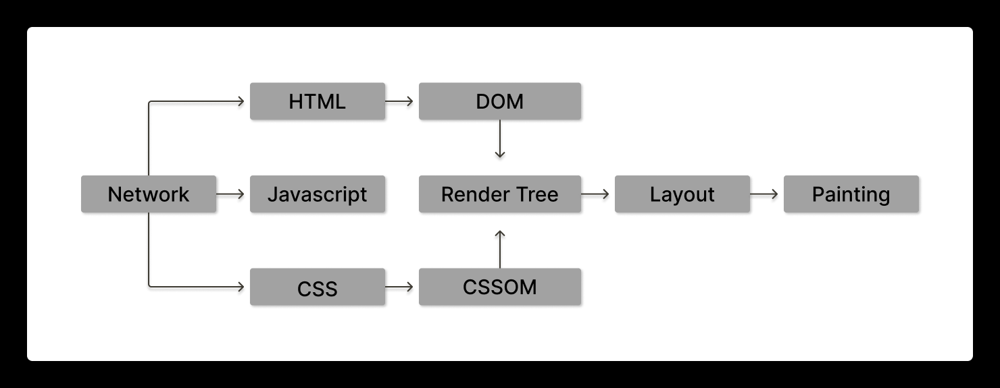
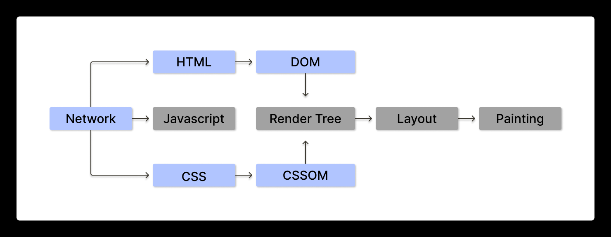
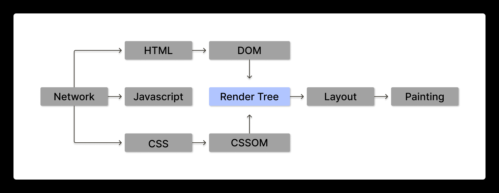
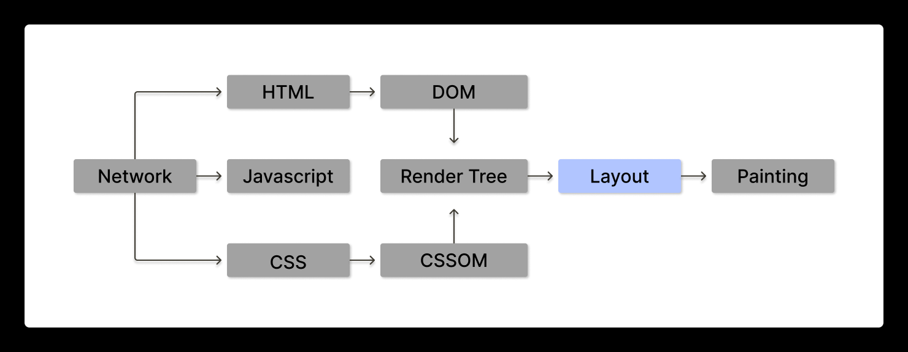
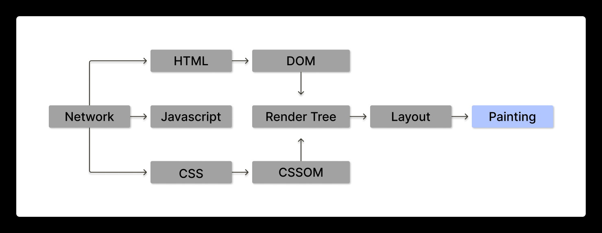
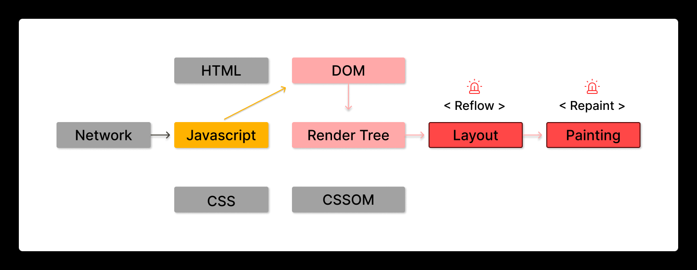

# web page rendering

## 개요

부트캠프 과정으로 React를 배우게 되었는데, React의 Single Page Application이 리액트의 중심이란건 배웠지만,

그 외에 어떤것들이 있는지 무엇이 다르길래 SPA방식의 라이브러리 또는 프레임워크가 떠오른 것인지

그리고 최근에 떠오른는 기술들은 무엇이 있는지 알아보고자 한다.

## 목차

### 1. [웹 페이지 렌더링이란?](#1-웹페이지-렌더링이란-what-is-a-web-page-rendering)

### 2. [웹 페이지의 렌더링 과정](#2-웹페이지의-렌더링-과정-web-page-rendering-process)

### 3. React의 Rendering 프로세스

### 4. 그 외의 다양한 렌더링 프로세스

### 5. 정리

##

## [1. 웹페이지 렌더링이란? (What is a Web Page Rendering)](#1-웹-페이지-렌더링이란)

## [2. 웹페이지의 렌더링 과정 (Web Page Rendering process)](#2-웹-페이지의-렌더링-과정)

전체 흐름도

 $\textsf{\huge{{ 1. HTML, CSS를 통해 DOM(Document Object Model), CSSOM(CSS Object Model) 생성 }}}$ 

**DOM**

-   HTML을 브라우저가 해석하기 편하게 변환한 객체 트리
-   HTML로 작성한 요소들의 배치와 모양을 기술한 모든 정보 존재

**CSSOM**

-   CSS로 작성해놓은 요소들의 스타일 관련된 모든 정보 존재

 $\textsf{\huge{{ 2. Render Tree 생성 }}}$ 

-   **`DOM`** & **`CSSOM`** 을 합쳐서 렌더트리 생성
-   **웹페이지의 청사진** 이라고도 불림 (배치와 모양 스타일 모두 존재)

 $\textsf{\huge{{ 3. Layout 생성 }}}$ 

-   **`Render Tree`** 기반으로 실제 웹 페이지에 요소들의 배치를 결정하는 작업

 $\textsf{\huge{{ 4. Painting 작업 }}}$ 

-   실제로 요소들을 화면에 그려내는 과정

 $\textsf{\huge{{ 5. javascript를 통한 DOM 업데이트 }}}$ 

-   `javascript`를 통해 `DOM` 업데이트는 `Critical Rendering Path`를 다시 실행함
-   각각 `Reflow`, `Repaint`라는 특별한 이름을 지을 정도로 `Layout`과 `painting` 작업은 연산이 많이 필요한 시간이 걸림
-   그래서 페이지를 업데이트 할 때 DOM의 수정을 최소화 해야함
-   그러나 서비스의 규모가 커질수록 이는 힘든 일
-   여기서 React의 Single Page Application (SPA)이 획기적인 성능을 보여주게 되어 프론트의 대세가 됌

